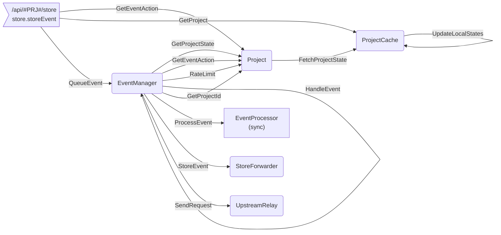

# Actors

This document describes how Semaphore works through the perspective of the system actors and the messages exchanged by them.

**TODO** Short description about infrastructure (i.e. actix-web, actix, tokio, futures), note that we are using the old style Future trait, and actix 0.7.x .

## controller.rs

## events.rs

The `events.rs` module contains functionality related to the processing of events. Raw events being sent to the system are first processed, and then sent to Sentry for saving.

The module contains to actors:

*  `EventManager` : an actor that receives all events, checks if the event should be processed (i.e. it is not filtered) and orchestrates all data needed for event processing. If the event should be processed it is passed to the `EventProcessor`. There is one `EventManager` in the system.
* `EventProcessor` : an CPU bound actor that receives all necessary project configuration and does the heavy lifting of processing the message (normalisation, PII stripping ...). There are multiple `EventProcessor` actors running in a thread pool.

### EventManager

The `EventManager` is an actor running in the main system arbiter. The system arbiter is a asynchronous arbiter  created when the Semaphore starts. The upshot of this is that all processing done by the event manager should be extremly quick. It is ok to wait on I/O but no significant processing may be done in the `EventManager`.

Once the `EventManager` had obtained the project state and had decided that the event should be processed the `EventManager` passes the event to the `EventProcessor` actors.


**TODO** document all handlers

### EventProcessor

The `EventProcessor` is an actor running in a SyncArbiter. There are multiple instances of the `EventProcessor` actor (roughly 1 per thread)  (**TODO** RaduW check that I'm not talking nonsense here.).

The `EventProcessor` does the heavy lifting of event processing. The event processing does only synchronous work ( all the IO is handleed in the `EventManager` and all the needed state is passed to the `EventProcessor`)

Since all the work done by the event processor is the synchronous processing of an event there is only one type of message accepted by the `EventProcessor` actor:

#### ProcessEvent

The `ProcessEvent` handler prepares the event for ingestion. It normalizes the event, symbolicates its stack-trace and strips sensitive information (PPI stripping).

**TODO** finish here

## keys.rs

## outcome.rs

## server.rs

## store.rs

## upstream.rs

## project.rs

The `project.rs` module contains functionality related to the project state. Sentry events belong to projects and projects belong to organizations (Semaphore doesn't care at the moment about organizations).

Projects serve to group the events (so that each Sentry customer can only see and deal with his/hers own events) and prescribe how messages are to be processed ( what should be filtered, which data inside the event should be anonymised (i.e PPI stripping), etc).

All activities around obtaining, caching and refreshing the project state is handled in this module.

The module contains two actors:

* `Project`: an actor that holds project data
* `ProjectCache`: an actor that holds references to `Project` actors. 

From a high level perspective one obtains a `Project` from the `ProjectCache` and then uses the `Project` in order to get 'project specific' information.

### Project

The `Project` actor is responsible with decisions about how an event for a particular project should be handled. The project runs in an async arbiter ( I think it actully runs in the SystemArbiter **TODO** check ir that is true, or if it runs in another async arbiter).

The system constructs an actor for each project used. 

The `Project` actor runs in an async context.

The `Project` actor responds to the following message types:

#### GetProjectId

The `GetProjectId` handler returns the `project_id` (trivial functionality).

#### GetProjectState

The handler retuns the `ProjectState`, either directly (if it has a recent cached version) or by asking the `ProjectCache` to fetch it on its behalf.

##### Pseudo Code

```python
if 'we have an up-to-date project state'
	return self.project_state
if not self.receiver: # we don't have an already active request for the project state 
    channel, receiver = 'create a channel and save its receiver'
    async: # ops that run at some time in the future
        project_state = await ProjectCache.send(FetchProjectState)
        channel.sender.push(project_state) # put the state on the channel when available
        channel = None # clenaup after we have pushed the ProjectState
return future(receiver) # a Future that resolves with the ProjectState when available
```

#### GetEventAction

The handler answers the question: How should an event be handled? 

An event may be handled in one of three ways specified by the `EventAction` enum.

```rust
pub enum EventAction {
    /// The event should be discarded.
    Discard(DiscardReason),
    /// The event should be discarded and the client should back off for some time.
    RetryAfter(RateLimit),
    /// The event should be processed and sent to upstream.
    Accept,
}
```

##### Pseudo Code

```python
if 'we have a cached rate limit value for the current event key':
  return RetryAfter # the event is discarded without further processing
if 'we have a recent project state'
  # Ask the ProjectState what to do with the msg
  return projectState.get_event_action(event) 
# No recent ProjectState, fetch it from the ProjectCache actor
async: # ops that run at soem time in the future
	projectState = await ProjectCache.send(FetchProjectState)
# return a future that will resolve when the project state becomes avaialble  
return future(projectState.get_event_action(event))
```

#### RateLimit

The handler is used to update chached versions of project RateLimits.

##### Pseudo Code

```python
if rate_limit.type not in self.rate_limit_cache
    self.rate_limit_cache.insert(rate_limit) # insert a new rate limit
else if "rate_limit expires sooner than the old cached value":
    self.rate_limit_cache.insert(rate_limit) # update old rate limit
```

### ProjectCache

The `ProjectCache`  actor is responsible for providing `Project` actors.

The `ProjectCache` runs in an asynchronous context. There is only one instance of the `ProjectCache` in the system.

The project runs in an async arbiter ( I think it actully runs in the SystemArbiter **TODO** check ir that is true, or if it runs in another async arbiter).

The `ProjectCache` actor responds to the following messages:

#### GetProject

Retuns a `Project` actor for the required project.

##### Pseudo Code

```python
if project_id not in self.project_cache:
  project = Project(project_id)
  project.start()
  self.project_cache[project_id] = project
  
return self.project_cache[porject_id] 
```

#### FetchProjectState

Registers the intention of a project to retrieve the project state.

The `FetchProjectState` functionality logicaly belongs to the `Project` actor but it is handled by the `ProjectCache` in order to batch requests for the project state from multiple `Project` actors. 

A `Project` registers its desire to obtain its project state with the `ProjectCache` by sending the `FetchProjectState` and the `ProjectCache` batches all requests during a batching period and emits one request to the upstream (another semaphore or the Sentry server) for all required project states.

The handler checks if there is already a scheduled time for fetching project states and, if not, it schedules a delayed function that will do the actual fetching for all projects that registered their desire for getting the project state (see function: `ProjectCache::fetch_states`). 

**TODO: Add pseudo code **


#### UpdateLocalStates

Updates project states for project states comming from a local file configuration.(TODO check if that is correct  RaduW.  10.Oct.2019)

This message is emmited periodically by a thread that loops and periodically checks the local file system for configuration changes (see function: `poll_local_states` ).


**Store endpoint request processing**



**Event ingestion**

```sequence
Title: Event Ingestion
store_event-->ProjectCache: GetProject
ProjectCache-->store_event: Project
store_event-->Project: GetEventAction
Project --> store_event: EventAction
store_event-->EventManager:QueueEvent
EventManager-->store_event:event_id
EventManager-->EventManager:HandleEvent
EventManager-->Project:GetProjectId
Project-->EventManager:ProjectId
EventManager-->Project:GetEventAction
Project-->EventManager:EventAction
EventManager-->Project:GetProjectState
Project-->EventManager:ProjectState
EventManager-->EventProcessor:ProcessEvent
EventProcessor-->EventManager:ProcessEventResponse
```


**Server bootstrap**

```sequence
main.main->cli.execute:
cli.execute->cli.execute:make_app
cli.execute->server.lib.run: 
server.lib.run->Controller: run
Controller->server.actors.Server: start
server.actors.Server->server.service:start
server.service->ServiceState: start

```

**ServiceState start**

```sequence
ServiceState->UpstreamRelay:start(config)
ServiceState->EventManager:start(config, upstream_realy)
ServiceState->KeyCache:start(config,upstream_relay)
ServiceState->ProjectCache:start(config, upstream_relay)
```


