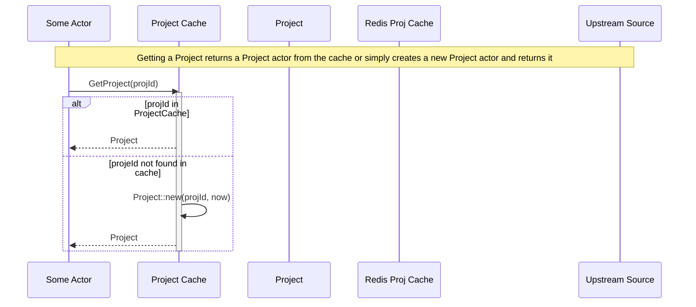
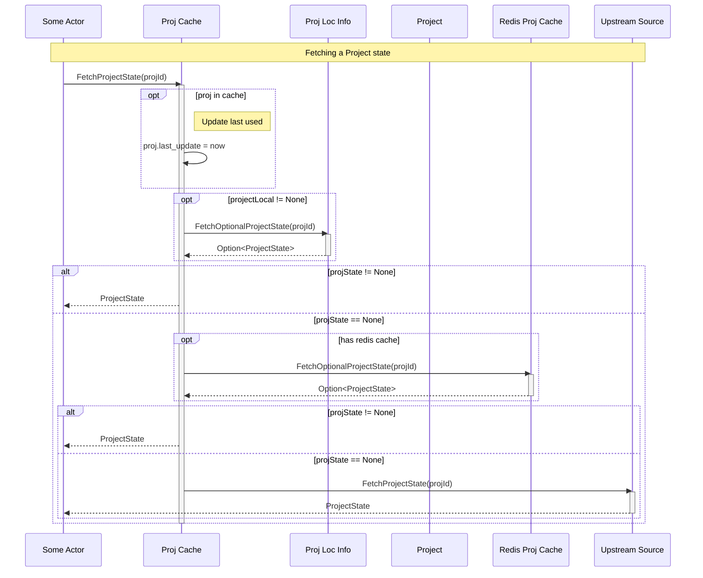
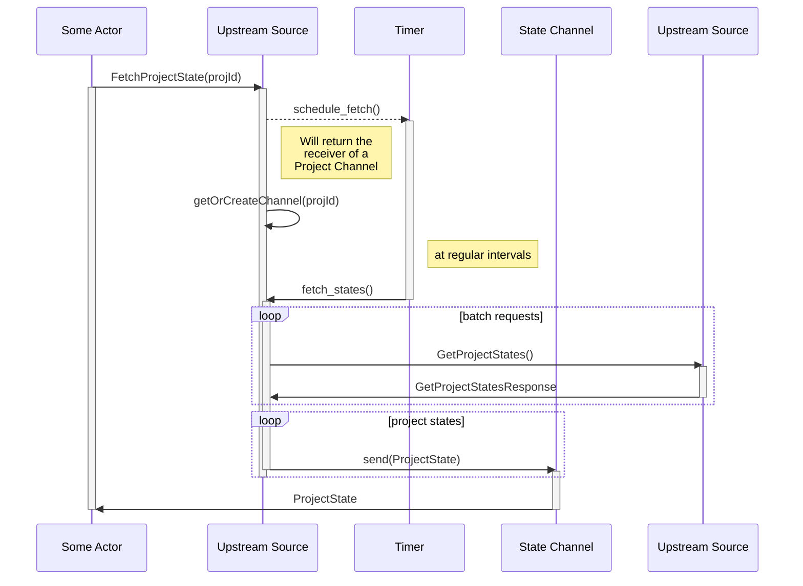

# Project configuration

This document describes how Relay deals with project configurations.

## Overview

## Getting a project

Here is how we obtain a Project actor ( used to get project configuration).

**Legend**

* Redis Proj Cache = Redis Project Cache
* Upstream Source = Upstream Project Source

## Getting a project state

Here is how we obtain project configuration.

**Legend**

* Proj Cache = Project Cache
* Proj Loc Info = Project Local Info
* Redis Proj Cache = Redis Project Cache
* Upstream Source = Upstream Project Source

## Fetching the project state from Redis

Fetching the project state from redis is straight forward.

Relay does not do any sort of management of project states in Redis. From Relay's point of view a project state is either in Redis (and then it uses it as a result) or it isn't and then it looks for the project state in other places (upstream).

If Relay obtains the project state from Upstream it will **NOT** insert it in Redis. It is up to other, external systems, to manage project states and add/remove/refresh them in Redis.

## Fetching the project state from Upstream 

If everything else fails and the ProjectCache can't obtain a project state from one of the chaches the Upstream will be queried for the ProjectState.

Here's what happens in the Upstream actor

**Legend**

* State Channel - Project State Channel
* Upstream Source - Upstream Project Source

.
