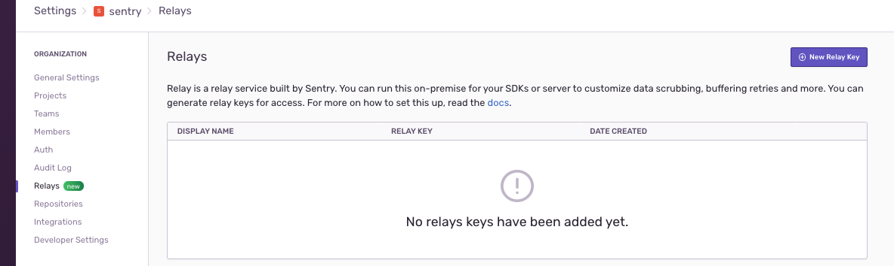
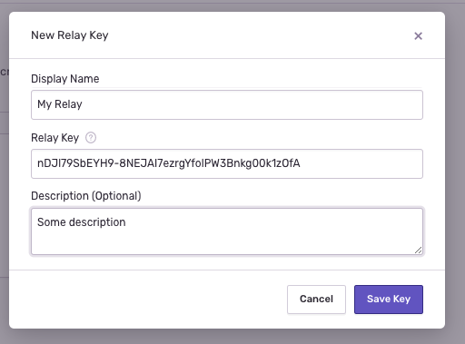

# Introduction

<p align="center">
  <p align="center">
    
  </p>
</p>

Sentry Relay is a work in progress service that pushes some functionality
from the Sentry SDKs as well as the Sentry server into a proxy process.

### What needs does Relay address ?

There are a few usage scenarios which Relay was designed to handle.

#### Removal of personal identifiable information (PII) from events

Without Relay, PII stripping can be done in the Sentry SDK or on the server side in Sentry's infrastructure.

Having PII stripping done inside the Sentry SDK has two disatvantages:

* puts potentially unacceptable processing burden on the applications that emit events
* it is not a unified mechanism and multiple applications potentially using multiple language SDKs need to be configured

Having PII stripping on Sentry's server side infrastructure, while solving the problems mentioned above, has the disadvantage that it implies transporting the messages with potentially sensitive information outside the barriers of an organization. This might not be an acceptable solution to some oranizations for various legal and complience reasons.

Running a Relay server inside an organization boundary can solve the PII striping problems mentioned above by both having the PII Striping done in one centrailzed place without putting any processing burden on the client applications and also having it done before the information leaves the organization infrastructure.

#### Increased event response time performance

Relay is designed to be extremely performant and it will respond very quickly to event requests. Having a Relay installed close to an organization infrstructure will further improve the response when sending events.

## Getting started

In this section we will create a simple setup using the default settings. Check the [In depth configuration]( ./indepthconfig) page for a detail discussion of various operating scenarious for Relay.

The Relay server is called `relay`. Binaries can be downloaded from the [GitHub releases page](https://github.com/getsentry/relay/releases). 

After downloading, place the binary somewhere on your `PATH` and make it executable.

In order to create the initial configuration Relay provides the`config init` command. The command creates configuration files
in the `.realy`  folder under the directory in which the command is run:

```bash
❯ ./relay config init
Initializing relay in /<current_directory>/.relay
Do you want to create a new config?:
> Yes, create default config
  Yes, create custom config
  No, abort

```

Selecting the default configuration will create  a minimal configuration file under `.relay/config.yml`. Below is an example of what the file looks like (**Note:** that the exact options and values may slightly change in time, we will update this doc when relevant changes are made ).

```yaml
---
relay:
  mode: managed
  upstream: "https://sentry.io/"
  host: 127.0.0.1
  port: 3000
  tls_port: ~
  tls_identity_path: ~
  tls_identity_password: ~

```

All configurations are explained in detail in the section [Configuration Options](../options), here we will go only through the basics.

Only a few options under the`relay` key are added to the configuration files in order to make it easy to configure the most common settings. All configuration keys are optional and `realy` will start when provided with an empty dictionary `{}` in the configuration file.

The `mode` setting configures the major mode in which Relay can operate and it is explained in detail in the [advanced configuration]( ./advanced_config) page.

The `upstream` setting configures the server to which Relay will forward the events ( by default the main sentry url).

The `port` and `host` settings configure the tcp port at which relay will listen to ( and therefore the addres to which an SDK or an application will send events). 

The `tls_...` settings configure tls support (https support) for Relay ( used for the cases where the communication between the SDK and Relay needs to be secured).

Besides `config.yml` the init process has also created a credentials file `credentials.json` in the same `./.relay/` directory.  This file contains the credentials used by Relay to authenticate with the upstream server (by default the infrastrcture operated by Sentry). **As such it is important that this file should be adequatly protected from modification or viewing by unauthorized entities**.

Here's an example of the contents of a typical credentials file:

```json
{
  "secret_key": "5gkTAfwOrJ0lMy9aOAOmHKO1k6gd8ApYkAInmg5VfWk",
  "public_key": "fQzvlvqLM2pJwLDwM_sXD2Lk5swzx-Oml4WhsOquon4",
  "id": "cde0d72e-0c4e-4550-a934-c1867d8a177c"
}
```

You will be using the `public_key` to register your Relay with the upstream server when running it in `managed` mode. 

Once you have registered your Relay with Sentry (see section below) you will be ready to run your Relay:

    $ relay run

If you moved your config folder somewhere else (e.g. for security reasons), you can use the `--config` option to specify the folder:

    $ relay run --config ./my/custom/relay_folder/

### Running in Docker

As an alternative to directly running the Relay binary sentry also provides a Docker image that can be used to run Relay.

Docker image for `relay` can be found at [`getsentry/relay`](https://hub.docker.com/r/getsentry/relay/).

Similarly to directly running the `relay` binary, running the docker image needs a configuration directory in which it can find the configuration and credentials files ( `config.yml` and `credentials.json`).

Providing the configuration directory can be done with the standard mechanisms offered by docker ([docker volumes](https://docs.docker.com/storage/volumes/)).

For example, you can start the latest version of `relay` as follows:

```sh
docker run -v $(pwd)/configs/:/etc/relay/ getsentry/relay run --config /etc/relay
```

The command assumes that Relay's configuration (`config.yml` and`credentials.json`) are stored in `./configs/` directory on the host machine.

### Registering Relay with the upstream server

When running in the default `managed` mode Relay needs to authenticate with the upstream server. 

In order for Relay to do its typical work, like PII stripping or filtering and rate limitting the number of events, Relay needs some configuration. This configuration is specific to an organization or even to a particular application within an organization (called a `project` in Sentry's terminology).

The mode in which a Relay operates controls how Relay obtains the `project` configuration. 

In the default (`managed`) mode, the configuration is provided by the upstream server (typically Sentry). 

Since `project` configuration may contain propriety information its access is restricted by the upstream server and requires authorization. 

A Relay needs to be registered with the upstream server (a server running the `sentry` server either operated by Sentry itself or run on one's private infrastructure).

In order to register the installed Relay with Sentry, get the contents of the public key, either by inspecting the `credentials.json` file or by running:

```
❯ ./relay credentials show
Credentials:
  relay id: 8cd24a0e-384d-4052-9010-68a21392b33c
  public key: nDJl79SbEYH9-8NEJAI7ezrgYfolPW3Bnkg00k1zOfA
```

After copying the public key go to the organization settings in Sentry (click on the top left icon and select Organization settings).

Go to Relays and click New Relay Key, add the key and save it:

<p align="center">
    
</p>


<p align="center">
    
</p>


Now your Relay is registered with Sentry and ready to send messages.

See  [advanced configuration]( ./advanced_config) page to learn more about Relay configuration.

# Sending a Test Event

After your Relay is registered with Sentry it is time to send a test event.

Start the Relay server (by running `relay run`).

Get the DSN of your project by navigating to your project settings | Client Keys (DSN) or type CMD + K (CTRL + K in Windows ) and type DSN. From the Client Keys page get the  DSN, it will look something like:

```
https://12345abcdb1e4c123490ecec89c1f199@o1.ingest.sentry.io/2244 
```

and replace the protocol from `https` to `http` and the server name to the Relay server `127.0.0.1:3000`, for our case it would look like:

```
http://12345abcdb1e4c123490ecec89c1f199@127.0.0.1:3000/2244 
```

Use the new DSN in your SDK configuration.

If using Sentry `sentry-cli` you can send a message like so:

```bash
SENTRY_DSN='http://12345abcdb1e4c123490ecec89c1f199@127.0.0.1:3000/2244' sentry-cli send-event -m 'A test event'
```

Go back to sentry and look for the event in your project.